# Code Scroller - UML Diagrams

This document contains PlantUML code for generating various UML diagrams for the Code Scroller project.

## How to Use

1. Copy the PlantUML code below
2. Paste it into [PlantUML Online Editor](https://www.plantuml.com/plantuml/uml/)
3. Or use VS Code with PlantUML extension
4. Generate PNG/SVG images

---

## 1. Entity Relationship Diagram (ER Diagram)

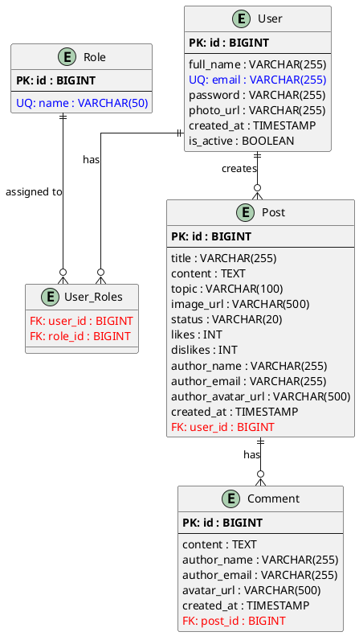

---

## 2. Class Diagram

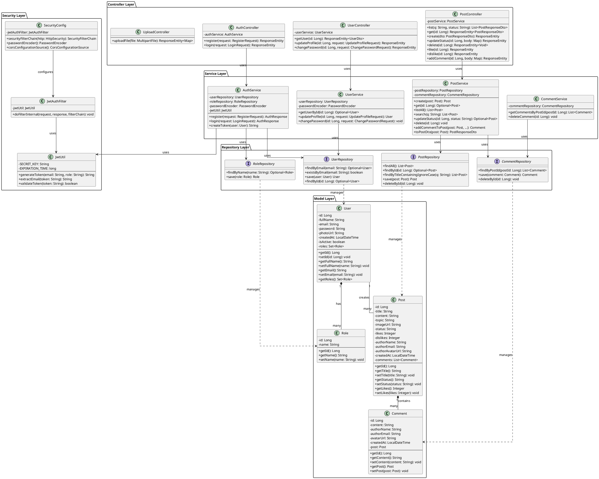

---

## 3. Use Case Diagram

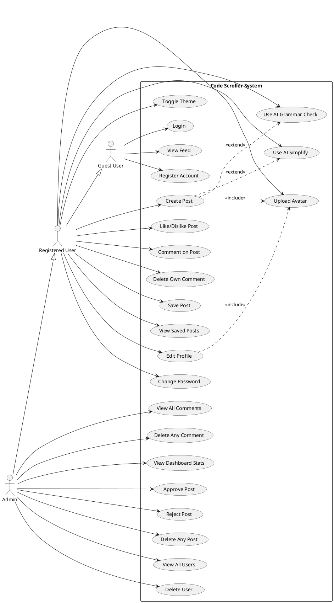

---

## 4. Sequence Diagram - User Registration and Login

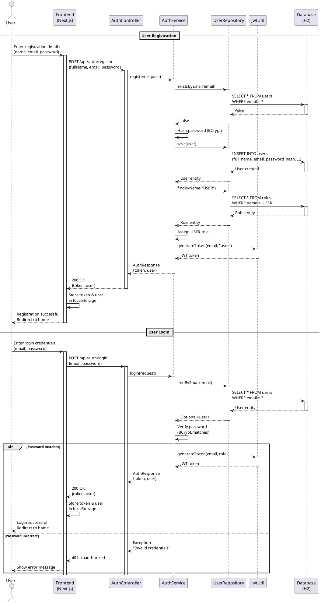

---

## 5. Sequence Diagram - Create and Approve Post

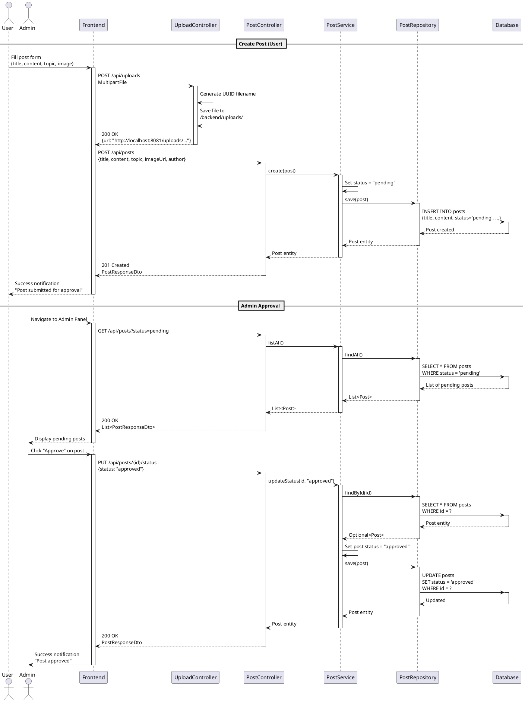

---

## 6. Activity Diagram - User Post Creation Flow

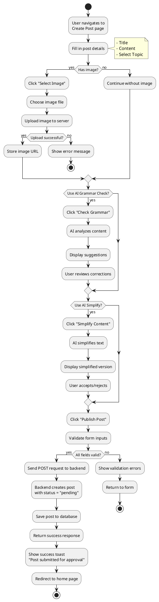

---

## 7. Activity Diagram - Admin Post Moderation

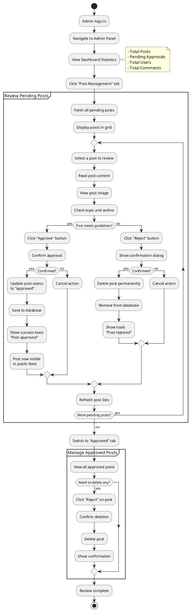

---

## 8. Data Flow Diagram (DFD) - Level 0 (Context Diagram)

```plantuml
@startuml Code_Scroller_DFD_Level_0

!define RECTANGLE rectangle
!define ENTITY actor
!define PROCESS circle

skinparam backgroundcolor transparent

ENTITY "Guest User" as guest
ENTITY "Registered User" as user
ENTITY "Admin" as admin

PROCESS "Code Scroller\nSystem" as system

guest --> system : View posts, Register, Login
system --> guest : Post feed, Registration confirmation

user --> system : Create posts, Comments,\nLikes, Profile updates
system --> user : Post status, Comment confirmations,\nUpdated profile

admin --> system : Approve/Reject posts,\nManage users, Moderate comments
system --> admin : Dashboard stats,\nUser/Post/Comment lists

@enduml
```

---

## 9. Data Flow Diagram - Level 1

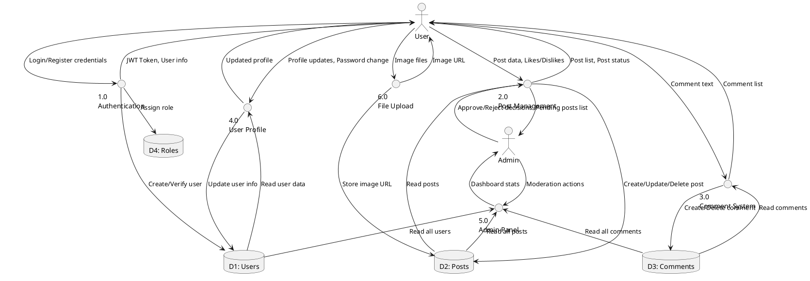

---

## 10. Component Diagram

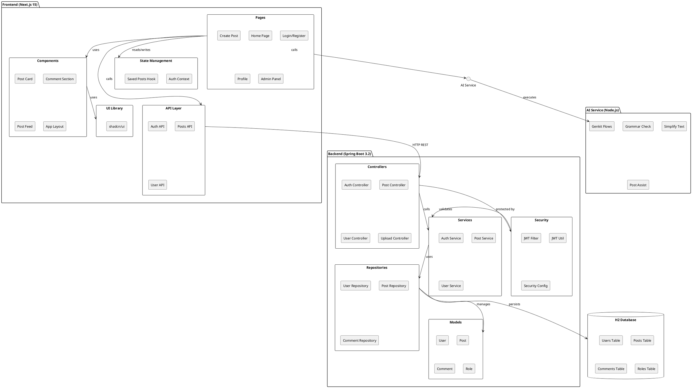

---

## 11. Deployment Diagram

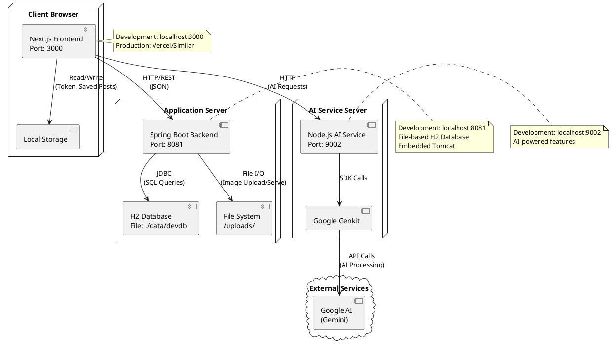

---

## 12. State Diagram - Post Lifecycle

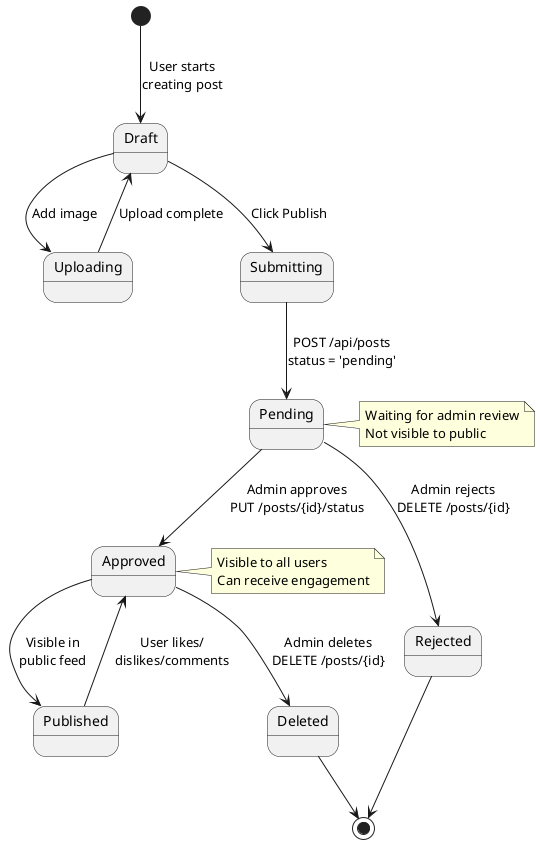

---

## 13. State Diagram - User Authentication State

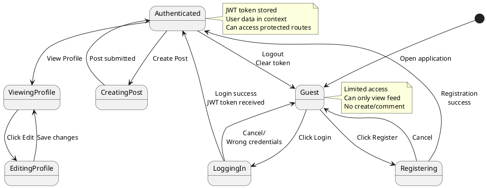

---

## How to Generate Diagrams

### Method 1: Online Editor
1. Go to https://www.plantuml.com/plantuml/uml/
2. Copy any diagram code above
3. Paste into the editor
4. Download as PNG, SVG, or PDF

### Method 2: VS Code Extension
1. Install "PlantUML" extension in VS Code
2. Create a `.puml` file with the diagram code
3. Press `Alt+D` to preview
4. Right-click → "Export Current Diagram" to save

### Method 3: Command Line
```bash
# Install PlantUML
npm install -g node-plantuml

# Generate PNG
puml generate diagram.puml -o output.png
```

---

## Diagram Descriptions

1. **ER Diagram**: Shows database schema with tables, columns, and relationships
2. **Class Diagram**: Complete class structure including all layers (Model, Repository, Service, Controller, Security)
3. **Use Case Diagram**: User roles and their available actions
4. **Sequence Diagrams**: Detailed interaction flows for registration, login, and post management
5. **Activity Diagrams**: Process flows for post creation and admin moderation
6. **Data Flow Diagrams**: System data movement at context and detail levels
7. **Component Diagram**: System architecture with frontend, backend, and AI service components
8. **Deployment Diagram**: Physical deployment architecture
9. **State Diagrams**: Lifecycle states for posts and user authentication

---

**Generated for Code Scroller Project**  
*Last Updated: November 4, 2025*
